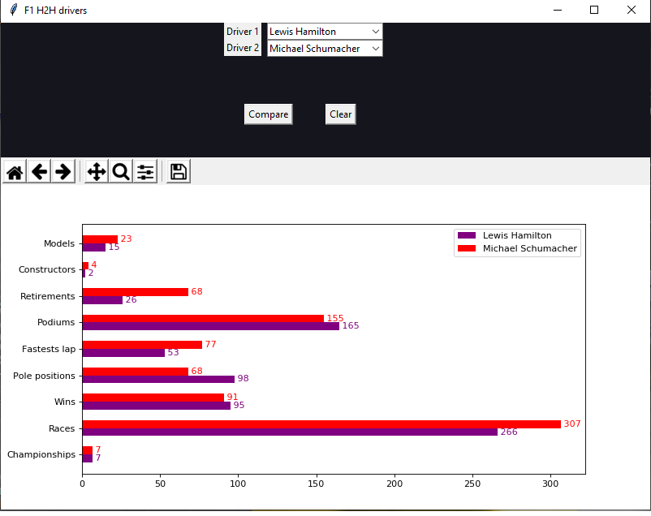

# H2H-F1-drivers-stats
A simple H2H F1 drivers stats app than compare two drivers. It shows stats like races, wins, pole postions, etc. 

## Table of contents
* [General info](#General-info)
* [Technologies](#Technologies)
* [Example](#Example)

#General info
Created with the purpose to learn web scraping, data analysis and gui, i developed to this app to merge many of these goals.
As a avid F1 fan, i designed this H2H from scratch, taking data for F1 web site, using pandas to keep usefull data and show it in a gui app.
This app allow you compare stats like race, wins, championships, etc between drivers from differents eras.  
  
#Technologies
  * Python
  * Jupyter Notebook
  * Beautiful Soup
  * Pandas
  * Numpy
  * Matplotlib
  * tkinter
  
#Example

Select two drivers from respectives list.

Press compare to show thier stats. Press clear to vanish the current graph.

